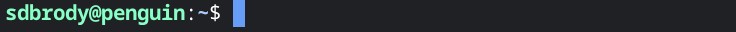

# Programming basics for crossword constructors
## Intro
This tutorial is intended for people who have tried their hand at crossword constructing (have basic familiarity with wordlists and at least one crossword construction program), and are interested in learning some programming skills to expand their capabilities.

When you complete the tutorial, you will be able to do things like:

- Find good entries for a complex theme
  - e.g.: all words scoring above 50 that start with "TA" end with "B" for a "split the tab" theme, or all words that become other words when an "N" is changed to an "S" for a "change directions" theme.
- Find good theme/revealer candidates
  - e.g.: phrases of the form "cut (the) ___" where the blank is a 3-to-5-letter word, for a book-end theme. 
- Create custom word lists
  - e.g.: all words that don't contain the letter "e", all words with a vowel in the middle.
- Manipulate and combine word lists
  - e.g.: add all high-scoring words from wordlist A to wordlist B, but reduce their scores by 10.
 

I tried to write the tutorial in a way that assumes little-to-zero prior programming experience. There will probably be some places where I failed at that. If you encounter any of those, please reach out at sdbrody@gmail.com.

While programming experience should not be necessary, you must be ready to invest time and effort in the process, and be willing to get a little more hands-on and technical than you're used to. Also, like any new skill, programming can be frustrating at first - not everything will work as expected the first few times. The best way to increase your confidence and skill is with practice. 

In many cases I'll only briefly touch on a subject or functionality, to give the minimum needed for the example. You'll need to do some searching on your own if you want to go beyond the basics. I will try to post some suggested links for each topic, to help get you started.

## Setup
The tutorial assumes you have a computer with a linux shell. On a Mac or Linux computer, this comes pre-installed in the form of an application called "Terminal". You should be able to open it from the program menu or launch bar.  

On a Windows machine, you'll need to install a program called WSL (Windows Subsystem for Linux) first. To do so, open the Powershell program (find it with the launch bar), and type `wsl --install`. Once installed, you can run the WSL program or open Powershell and type `wsl` to get you to the linux shell.

Whatever system you use, you should see something like this:

This is called the command-line prompt (because it prompts you to type in a command). The default prompt consists of your username, followed by the **@** sign, then the name of your computer, then a colon, then your current directory path (which is **~** when you first open the shell), and finally a **$** sign.  

> 📖 Further Reading: [customizing the command prompt](https://ioflood.com/blog/bash-prompt/)

To check for Python, type `python3 --version` and press enter. If it prints out a version number, you are good to go.

## Overview
This tutorial is composed of three chapters:
1. [The Basics of BASH](shell_basics.md) - Upon completing this chapter, you'll be able to do the following from the command line:
   - move through the file system and its folders (relevant commands: `cd, ls`)
   - create, copy, and read text files (`cp, mv, mkdir, echo, cat, head, tail, less, nano`)
   - understand how to chain commands to gether, using standard input/output, pipes, and redirection (`>, >>, |`)
   - write simple executable files as short-cuts for commands you use frequently (shell scripts)  

   _This chapter can be skipped by those familiar with BASH and the concepts listed above._

2. [Text Search and Manipulation Tools](shell_text_manip.md): covers `tr, sort, cut, grep, sed`.
3. [Python Basics for Crossword Construction](python_basics.md): covers basic concepts and gives examples for common tasks of interest to crossword constructors for theme development and wordlist management.
